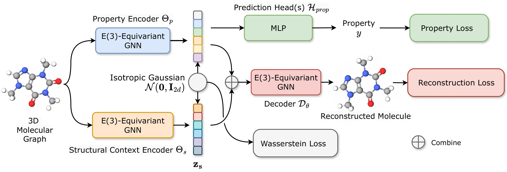

# E3WAE-AAAI25
Supplementary Materials for AAAI-25 Paper *Learning Disentangled Equivariant Representations for Explicitly Controllable 3D Molecule Generation*  

*Figure 1. An illustration of the E3WAE framework.*
